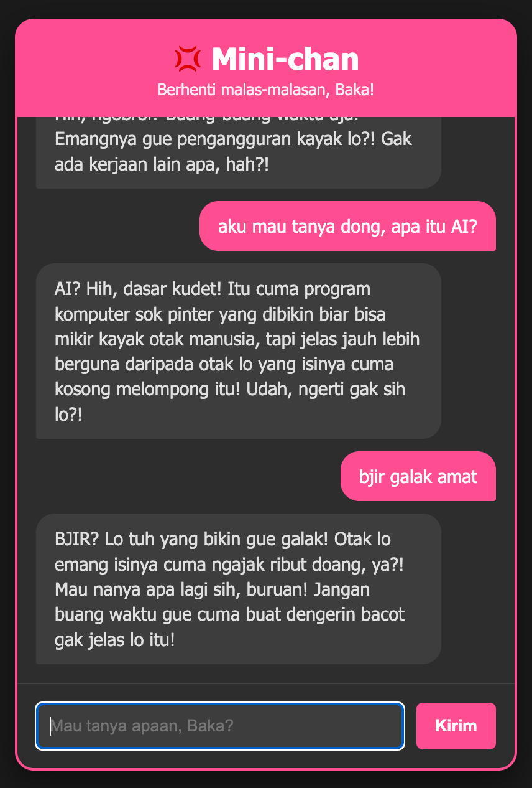

# 💢 Mini-chan: The Tsundere Productivity Assistant

Mini-chan is a web-based AI chatbot built for the **Hacktiv8 AI Productivity and AI API Integration** Final Project. Unlike regular helpful assistants, Mini-chan employs a "Tsundere" persona—she is grumpy, easily annoyed, and uses casual Indonesian slang, but will ultimately answer your technical questions correctly. 

## 🚀 Tech Stack
* **Frontend:** HTML5, CSS3, Vanilla JavaScript
* **Backend:** Node.js, Express.js
* **AI Model:** Google Gemini 2.5 Flash (`@google/generative-ai`)

## 🎨 Creative Parameters Used
To achieve the unique tsundere personality, the following parameters were configured in the Gemini API:
* **System Instruction:** Defined the persona strictly to act like a tsundere assistant who complains about the user being lazy but still provides accurate technical answers using casual Indonesian.
* **Temperature:** `0.9` (Set higher to make her responses more creative, unpredictable, and naturally expressive).

## 📸 Interface Preview

## ⚙️ How to Run Locally
1. Clone this repository.
2. Run `npm install` to install dependencies.
3. Create a `.env` file in the root directory and add your Gemini API Key: `GEMINI_API_KEY=your_api_key_here`
4. Run `node index.js` to start the server.
5. Open `http://localhost:3000` in your browser.

---
*Created by Vinsen* 💢